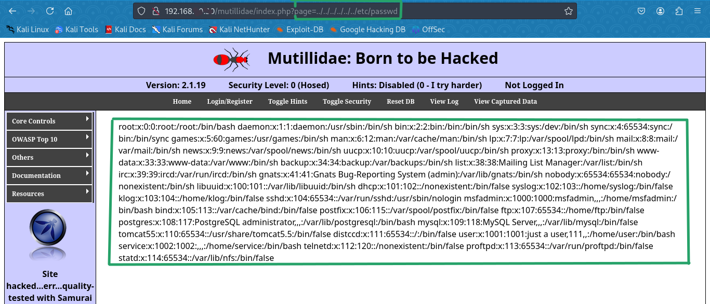

DESCRIPCIÓN
Broken Access Control ocurre cuando los usuarios pueden realizar acciones fuera de sus permisos intencionados. Por ejemplo, acceder a archivos o recursos que deberían estar restringidos, como /etc/passwd en sistemas Linux.

  ENTORNO DE PRUEBAS

- Kali Linux como atacante
- Metasploitable2 como víctima
- Conectividad establecida entre ambas máquinas virtuales
- IP de la víctima: `192.168.X.X (reemplazar por la real)

ACCESO A UN SERVIDOR WEB VULNERABLE (Path Traversal)

Realizamos un escaneo de red utilizando el siguiente comando:

Con este escaneo identificamos los servicios y puertos abiertos. Detectamos un servicio HTTP ejecutándose en el puerto 80, lo que indica la presencia de un servidor web.
Accedemos a la IP en un navegador y encontramos la aplicación Mutillidae. Hacemos clic en “Mutillidae” para ingresar al entorno de pruebas.
Mutillidae es una aplicación web diseñada para practicar pruebas de penetración (pentesting), basada en el proyecto OWASP.

En el menú principal, accedemos a OWASP TOP 10 y luego seleccionamos:
A4 - Insecure Direct Object References Posteriormente, hacemos clic en Text File Viewer

Observamos que en la barra de direcciones del navegador aparece el parámetro page=TextFileViewer.php. Esta es una señal de que el sitio podría ser vulnerable a Path Traversal.

Probamos la vulnerabilidad modificando la URL de la siguiente forma: (Relative Path Traversal o Absolute Path Travesal)

(Relative)?page=../../../../etc/passwd

(Absolute)?page=/etc/passwd

El uso de ../ nos permite subir directorios en el sistema de archivos. Aunque no hay un límite estricto, normalmente con 4 niveles es suficiente para llegar a la raíz (/).
Al ejecutar esta modificación y presionar Enter, el contenido del archivo /etc/passwd se muestra en pantalla.
Este archivo contiene información sobre los usuarios del sistema. También podemos intentar acceder a otros archivos como /etc/group. Sin embargo, algunos archivos pueden estar restringidos porque no tenemos privilegios de administrador (root), ya que el servidor web se ejecuta bajo un usuario limitado.

En algunas ocasiones, los servidores web están configurados de forma que filtran o eliminan secuencias como ../ de la URL, evitando que el atacante pueda navegar por el sistema de archivos. Sin embargo, existen técnicas para evadir estos filtros, como:

    Usar secuencias visualmente similares: ....// (equivalente a ../)

    Usar codificación URL: %2e%2e%2f (versión codificada de ../)

    Usar patrones que explotan errores de decodificación: ..%c0%af

Estas técnicas pueden burlar filtros simples que solo buscan coincidencias exactas con la cadena ../, permitiendo que el atacante logre el mismo efecto de path traversal si el sistema no maneja correctamente la validación y normalización de rutas.

> Autor: Jerson Giraldo  
> Proyecto: OWASP Top 10 Lab  
> Año: 2025
