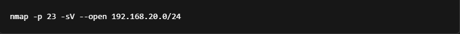
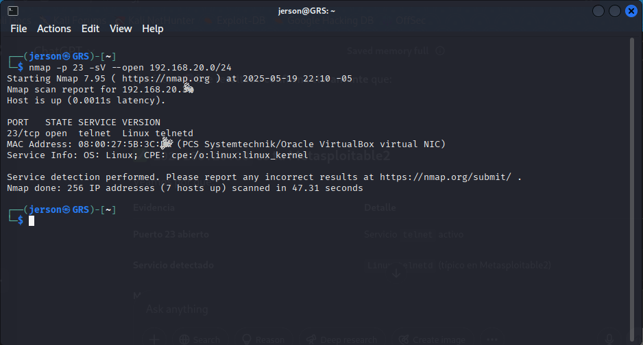
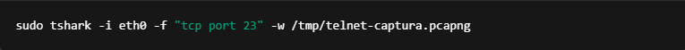
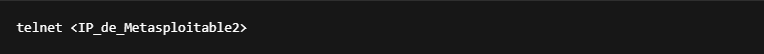
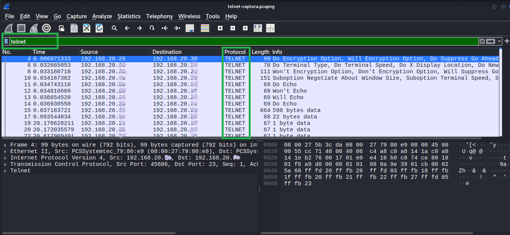
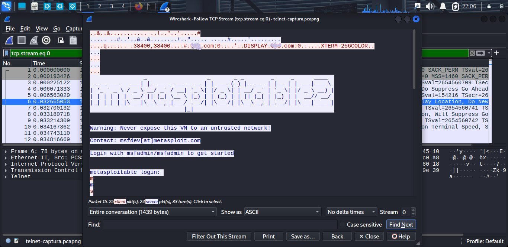
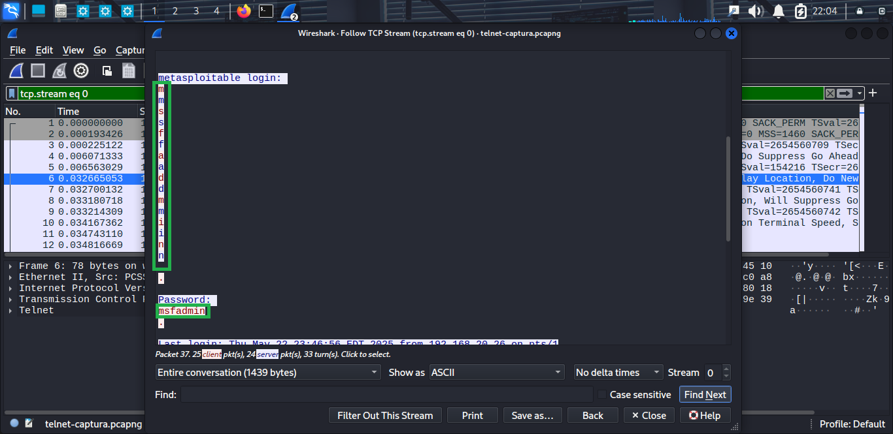

Laboratorio: Ataque por Exposición de Datos Confidenciales (A02:2021 - Cryptographic Failures) usando Telnet
Paso 1: Escaneo de la red para identificar hosts con Telnet activo

nmap -p 23 -sV --open 192.168.20.0/24

    -p 23: Escanea solo el puerto 23, que corresponde a Telnet.

    -sV: Detecta la versión del servicio que está corriendo en ese puerto.

    --open: Muestra solo los hosts que tienen el puerto abierto.

    192.168.20.0/24: Rango de direcciones IP a escanear (todas las IPs de 192.168.20.0 a 192.168.20.255).

Resultado esperado:
Se detectará la IP de la máquina Metasploitable2 con el puerto 23 abierto, servicio linux telnetd corriendo, sistema operativo Linux y un prefijo MAC 08:00:27 característico.

Paso 2: Preparación de máquinas para el laboratorio

    Kali Linux:

        Activar Tshark en una pestaña diferente a la de telnet para capturar el tráfico de red. (Ejecutar Paso 3)

    Metasploitable2:

        Encender la máquina (sin necesidad de ingresar credenciales).

        Telnet estará habilitado por defecto.

Paso 3: Captura de tráfico Telnet con Tshark

Ejecuta el siguiente comando en Kali para capturar el tráfico Telnet hacia Metasploitable2:

sudo tshark -i eth0 -f "tcp port 23" -w /tmp/telnet-captura.pcapng

    -i eth0: Interface de red a monitorear (puedes usar ip a para verificar el nombre correcto si no es eth0).

    -f "tcp port 23": Filtro para capturar solo tráfico Telnet (puerto TCP 23).

    -w /tmp/telnet-captura.pcapng: Guarda la captura en un archivo en formato .pcapng para análisis posterior.

Nota:
Ejecuta este comando desde tu directorio personal o especifica una ruta absoluta donde tengas permisos de escritura.
Luego, si quieres mover el archivo a tu carpeta personal: sudo mv /tmp/telnet-captura.pcapng /home/Tu_usuario/.........

Paso 4: Conexión Telnet y captura de credenciales en texto plano

Desde Kali, en una pestaña difrente a la de tshark conéctate a la máquina Metasploitable2 vía Telnet:

telnet <IP_de_Metasploitable2>

    Cuando se soliciten credenciales, ingresa:

        Usuario: msfadmin

        Contraseña: msfadmin

    Importante: Las credenciales viajan en texto plano por Telnet, lo que permite que Tshark las capture.

Paso 5:Finalmente, vuelves a la primera pestaña (Tshark) y presionas CTRL + C para detener la captura.

Paso 6: Análisis del archivo capturado con Tshark

Para visualizar el contenido capturado (incluyendo usuario y contraseña):

sudo tshark -r /tmp/telnet-captura.pcapng -Y telnet -T fields -e telnet.data

    -r: Lee el archivo capturado.

    -Y telnet: Filtra solo paquetes Telnet.

    -T fields -e telnet.data: Muestra solo los datos de Telnet (el texto transmitido).

Busca las líneas donde se muestren tus credenciales expuestas en texto plano.

Nota:Despues de hacer el (paso 6) también puedes guardar el archivo telnet-captura.pcapng en otro directorio de preferencia y abrirlo con wireshark para un análisis más visual.

Visualización de credenciales capturadas con wireshark

paso 7: Una vez abierto el archivo en Wireshark:

En el filtro superior, escribe telnet y presiona Enter para ver solo el tráfico Telnet.

Puedes hacer clic derecho sobre cualquier paquete → Follow > TCP Stream para ver toda la conversación (incluyendo credenciales en texto plano).

A continuación se muestra una captura del archivo "telnet-captura.pcapng" abierto en Wireshark, donde se evidencian las credenciales transmitidas en texto plano a través de Telnet:

